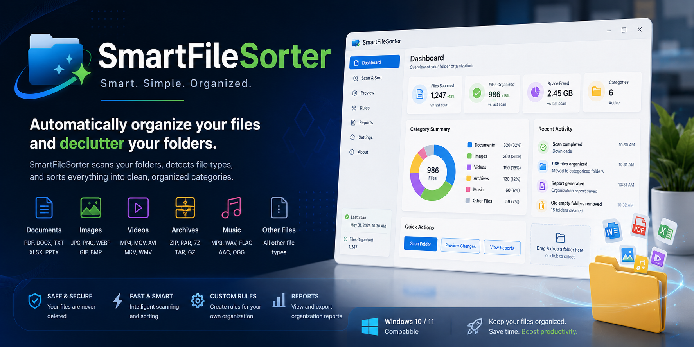
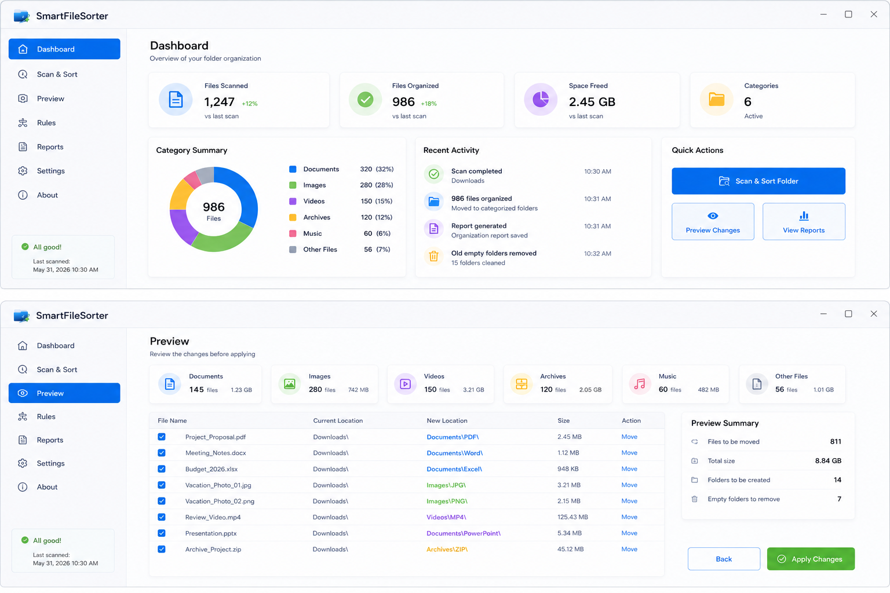
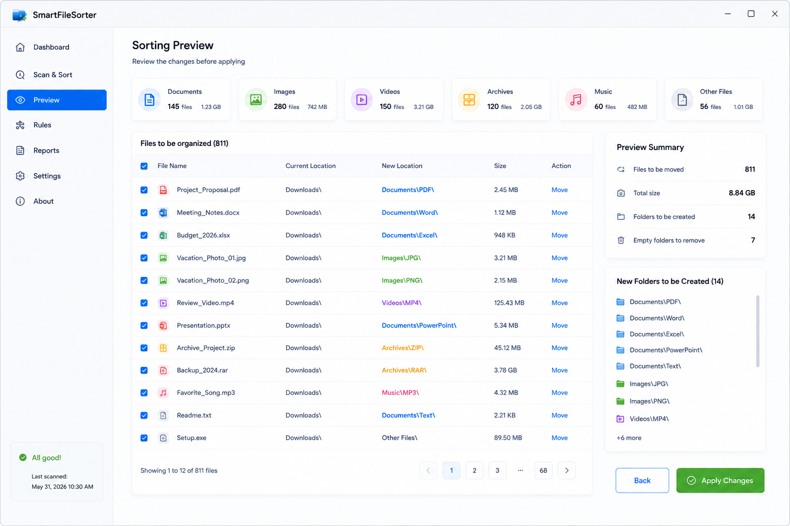

# SmartFileSorter
Smart desktop file organizer that automatically sorts documents, images, archives, videos, and downloads into clean folders

# SmartFileSorter

<p align="center">
  
</p>

<p align="center">
  Smart desktop file organizer for documents, images, archives, videos, and downloads.
</p>

<p align="center">
  
  
  
  
</p>

---

## Overview

SmartFileSorter is a lightweight Windows desktop utility designed to help users keep folders clean and organized.

It can scan selected folders, detect common file types, and move files into structured categories such as Documents, Images, Videos, Archives, Music, and Other Files.

---

## Features

* Smart file type detection
* Automatic folder sorting
* Downloads folder cleanup
* Custom sorting rules
* Preview before applying changes
* File activity summary
* Clean and simple dashboard
* Exportable organization report

---

## Supported Categories

* Documents: PDF, DOCX, TXT, XLSX, PPTX
* Images: PNG, JPG, JPEG, WEBP, GIF
* Videos: MP4, MOV, AVI, MKV
* Archives: ZIP, RAR, 7Z
* Music: MP3, WAV, FLAC
* Other Files

---

## Screenshots

### Main Dashboard



### Sorting Preview



---

## Installation

1. Download the latest release.
2. Extract the ZIP archive.
3. Run SmartFileSorter.exe.
4. Select a folder.
5. Preview and apply sorting.

---

## Project Structure

```text
SmartFileSorter/
├── assets/
│   ├── banner.png
│   ├── screenshot-1.png
│   └── screenshot-2.png
├── src/
│   ├── FileScanner.cs
│   ├── FileSorter.cs
│   ├── SortingRule.cs
│   └── ReportGenerator.cs
├── README.md
├── LICENSE
├── CHANGELOG.md
└── .gitignore
```

---

## Requirements

* Windows 10 or Windows 11
* .NET Runtime

---

## Roadmap

* Drag and drop folder support
* Duplicate file detection
* Rule presets
* Dark and light themes
* Scheduled folder cleanup

---

## License

MIT License

---

## Support

If this project is useful, consider starring the repository.
